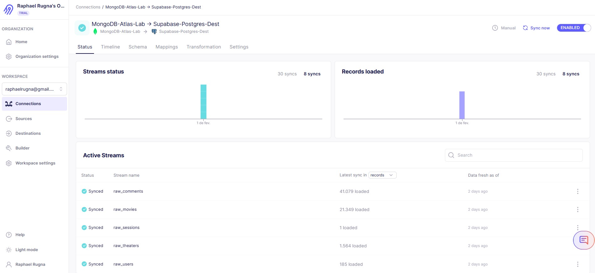
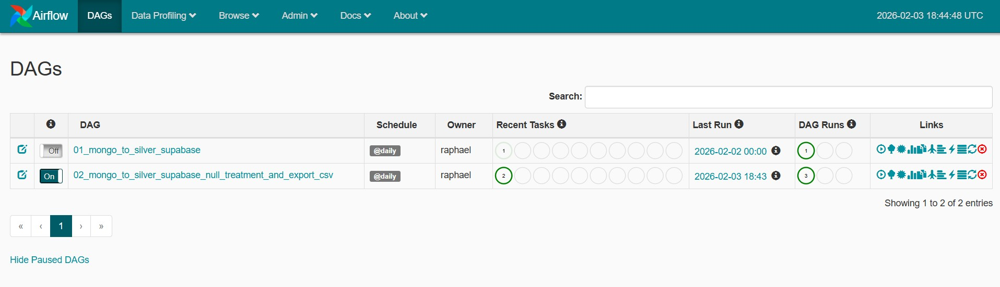
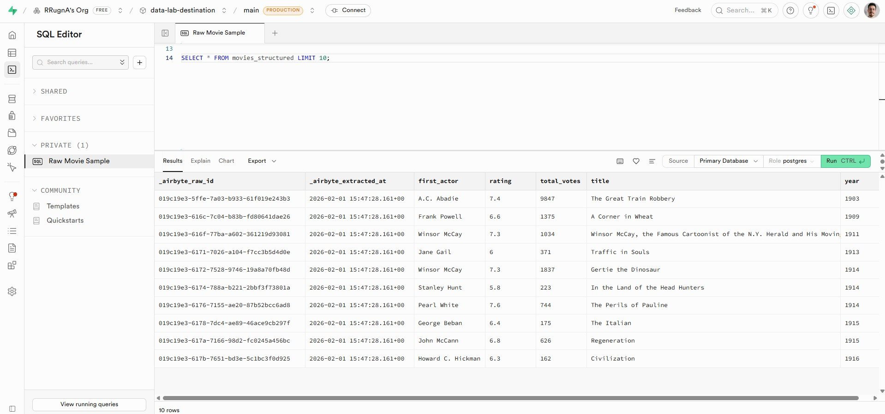
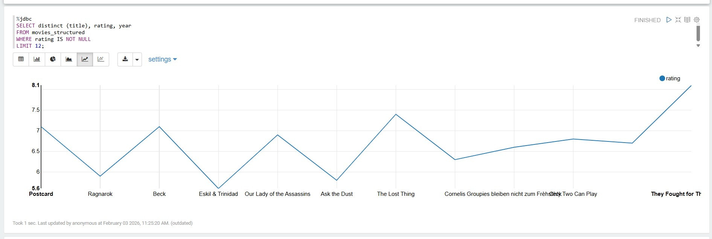

# Data Pipeline: MongoDB to Supabase (Medallion Architecture)
Este projeto demonstra a construção de um pipeline de dados ponta a ponta, integrando fontes NoSQL locais/nuvem a um Data Warehouse moderno no PostgreSQL (Supabase), orquestrado por Apache Airflow.

## 🚀 Tecnologias Utilizadas
- **Ingestão:** Airbyte Cloud
- **Orquestração:** Apache Airflow (Docker)
- **Banco de Dados:** MongoDB Atlas (Fonte) & Supabase / PostgreSQL (Destino)
- **Visualização:** Apache Zeppelin
- **Transformação:** SQL (PostgreSQL JSONB)

## 📥 Ingestão de Dados (Airbyte)
Para a fase de extração e carga (EL), utilizei o  **Airbyte Cloud:**
- **Source:** Conectado ao MongoDB Atlas (Replica Set).
- **Destination:** PostgreSQL no Supabase.
- **Sync Mode:** Incremental Append + Dedup (ou Full Refresh para este lab), garantindo que os documentos NoSQL fossem mapeados para colunas `JSONB` na tabela `raw_movies`.
  
## ⚙️ Orquestração e Transformação (Airflow)
- **Automação:** DAGs desenvolvidas em Python para automatizar a camada de transformação.
- **SQL Moderno:** Uso de lógica `CASE WHEN` e `CAST` para extrair dados de objetos JSON complexos e transformá-los em tipos relacionais (`float`, `int`, `text`).

## 🏗️ Arquitetura do Projeto
O pipeline segue os princípios da **Medallion Architecture:**
- **Bronze (Raw):** Ingestão bruta de documentos JSON do MongoDB para tabelas `raw_` no PostgreSQL.
- **Silver (Clean):** Transformação e tipagem de dados via Airflow, convertendo campos JSONB em colunas relacionais.
- **Gold (Analytics):** Visualização de métricas de filmes e notas para consumo de BI.

## 🛠️ Desafios Técnicos Superados
**1. Autenticação SCRAM-SHA-256 (Authentication Type 10)**
Ao conectar ferramentas locais ao Supabase, identifiquei uma incompatibilidade de handshake. Resolvi o problema atualizando os **artifacts JDBC** para a versão `42.5.4` e configurando a string de conexão com parâmetros de `tenant/project ID`.

**2. Tratamento de Qualidade de Dados (Null Treatment)**
Implementei lógica de `CASE WHEN` em SQL para tratar strings vazias vindas da fonte NoSQL, garantindo que a conversão para `FLOAT` e `INT` não quebrasse as ferramentas de visualização.

```
SQL

CASE 
    WHEN (imdb->>'rating') = '' THEN NULL 
    ELSE (imdb->>'rating')::float 
END as rating
```
## 📊 Resultados
- **Conectividade Cloud-to-Cloud:** Ingestão bem-sucedida de documentos JSON provenientes de uma instância do **MongoDB Atlas** para o **PostgreSQL no Supabase**. 
- **Mapeamento NoSQL para Relacional:** Configuração do Airbyte para persistir os dados na tabela `raw_movies`, preservando a estrutura original em colunas `JSONB` para processamento posterior.
- **Resiliência e Escalabilidade:** Utilização de uma ferramenta líder de mercado para garantir a integridade dos metadados durante a migração entre diferentes paradigmas de banco de dados. <br>
- **Pipeline Automatizado:** DAGs do Airflow configuradas com sucesso. 
- **Dados Estruturados:** Visualização limpa no editor do Supabase. 
- **Insights Gerados:** Dashboards funcionais no Apache Zeppelin. 
